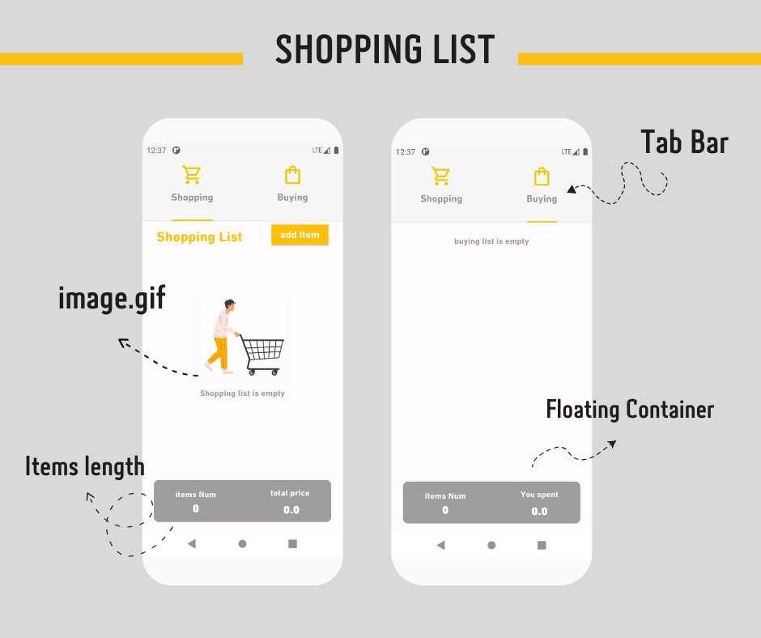
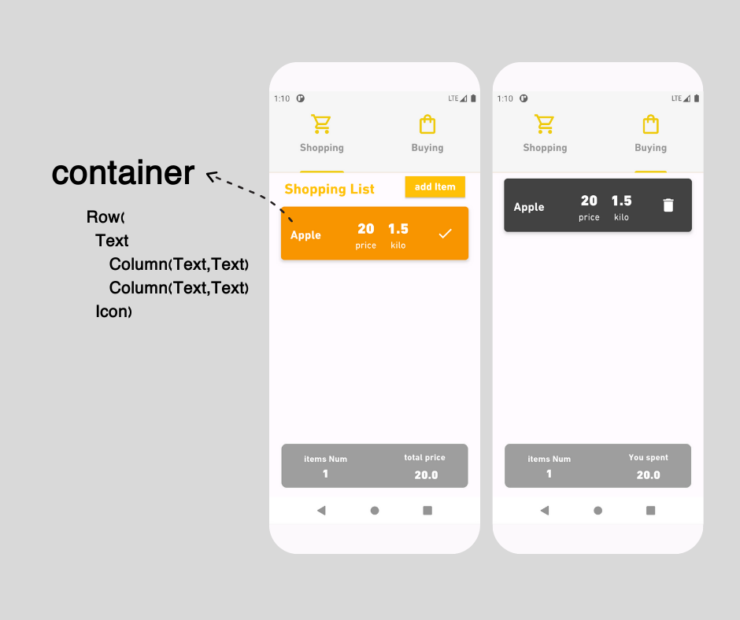
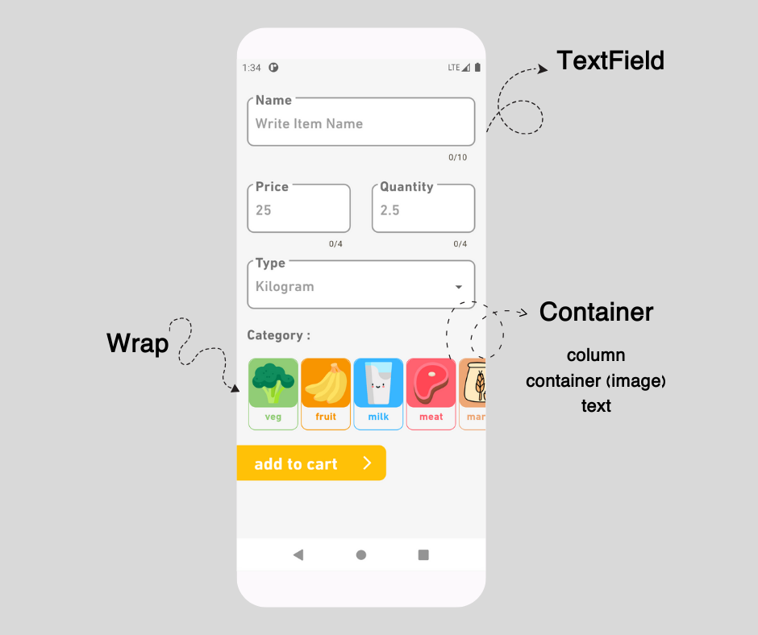
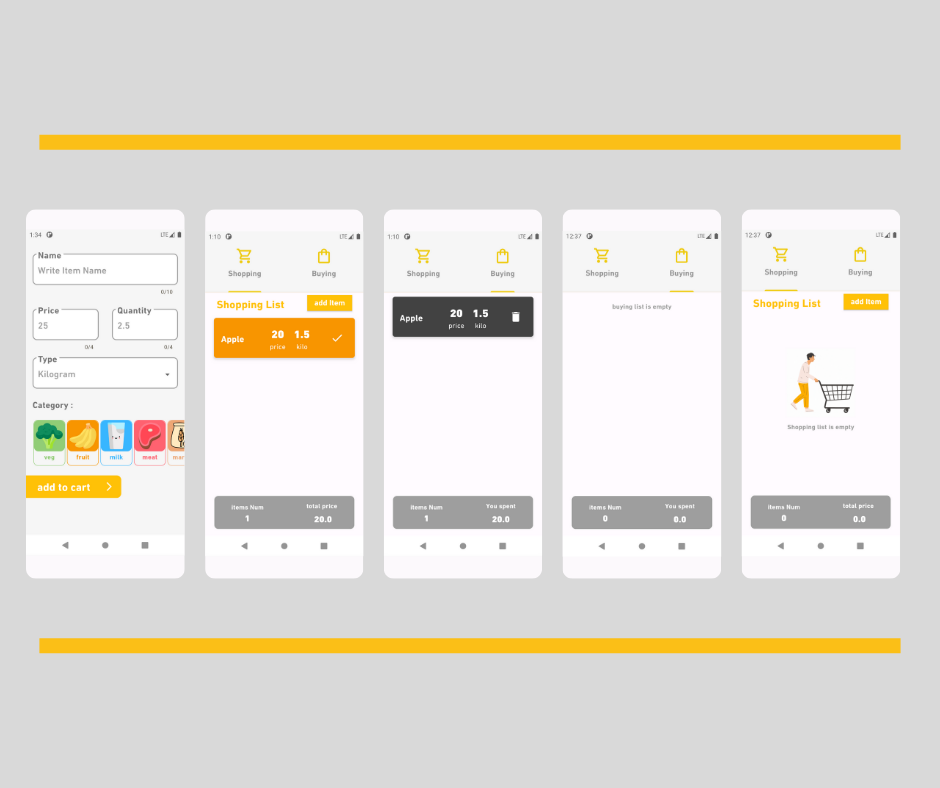

# ✨Shopping List App  

Simple shopping and Buying List app

using SQLite flutter

Star⭐ the repo if you like what you see😉.

## 📸 ScreenShots

- [Lab: Write your first Flutter app](https://docs.flutter.dev/get-started/codelab)
- [Cookbook: Useful Flutter samples](https://docs.flutter.dev/cookbook)

For help getting started with Flutter development, view the
[online documentation](https://docs.flutter.dev/), which offers tutorials,
samples, guidance on mobile development, and a full API reference.
